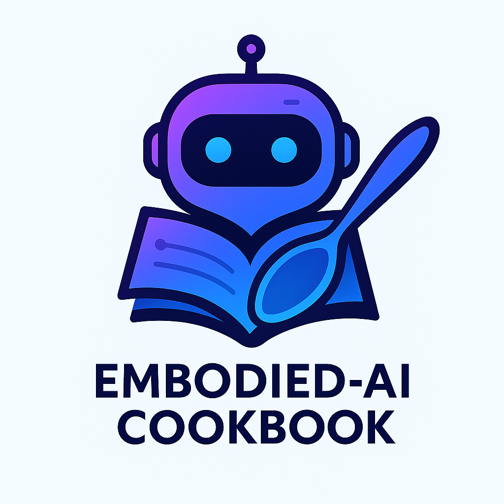

  
  <h1>Embodied AI Cookbook | 具身智能菜谱</h1>
  
  

    <a href="https://huashanjian.github.io/embodied-ai-cookbook/">🌐 Visit Website | 访问网站</a> •
    <a href="https://github.com/huashanjian/embodied-ai-cookbook">📚 GitHub Repo | 仓库</a> •
    <a href="./CONTRIBUTING.md">🤝 Contributing | 贡献</a>
  

## 🍳 Welcome to the Kitchen! | 欢迎来到厨房！

This is a curated learning path for **Embodied AI** beginners. We hand-pick the best tutorials, papers, and videos to guide you from basic concepts to advanced applications.

本项目是**具身智能**初学者的精选学习路径。我们精心挑选最优质的教程、论文和视频，引导你从基础概念到高级应用。

---

## 🌍 Choose Your Language | 选择你的语言

### 🇬🇧 English
**[→ Start Learning in English](https://huashanjian.github.io/embodied-ai-cookbook/en/)**

*A comprehensive guide to Embodied AI with curated resources, step-by-step tutorials, and hands-on projects.*

### 🇨🇳 中文
**[→ 开始中文学习](https://huashanjian.github.io/embodied-ai-cookbook/zh/)**

*全面的具身智能学习指南，包含精选资源、循序渐进的教程和实践项目。*

---

## 🎯 What You'll Learn | 你将学到什么

- **Core Concepts** | 核心概念：Understanding embodied intelligence fundamentals
- **Practical Skills** | 实用技能：Hands-on experience with simulation platforms  
- **Real Applications** | 真实应用：From robotics to virtual assistants
- **Latest Research** | 最新研究：Cutting-edge papers and breakthroughs

## 🚀 Zero Setup Required | 无需环境配置

Just pick your language and start learning! No complex installations needed.

选择你的语言就开始学习吧！无需复杂的安装配置。

---

## 🤝 Contributing | 贡献

We welcome contributions in all languages! See our [Contributing Guide](./CONTRIBUTING.md).

我们欢迎各种语言的贡献！请查看我们的[贡献指南](./CONTRIBUTING.md)。

---

**🎉 Ready to explore Embodied AI? Choose your language above! | 准备探索具身智能了吗？在上面选择你的语言！**

