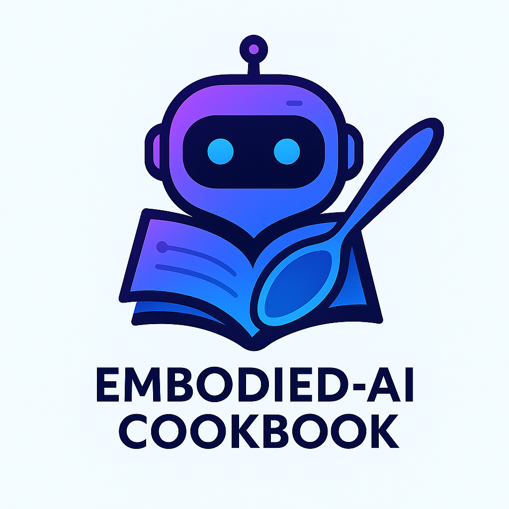

  

# Embodied AI Cookbook | 具身智能菜谱

<h2>🍳 Welcome to the Kitchen! | 欢迎来到厨房！</h2>

A curated learning path for <strong>Embodied AI</strong> beginners

一个为<strong>具身智能</strong>初学者准备的精选学习路径

---

## 🌍 Choose Your Language | 选择你的语言

### 🇬🇧 English

<a href="en/" class="md-button md-button--primary">Start Learning in English</a>

*A comprehensive guide to Embodied AI with curated resources, step-by-step tutorials, and hands-on projects.*

### 🇨🇳 中文

<a href="zh/" class="md-button md-button--primary">开始中文学习</a>

*全面的具身智能学习指南，包含精选资源、循序渐进的教程和实践项目。*

---

## 🎯 What You'll Learn | 你将学到什么

-   :material-brain:{ .lg .middle } **Core Concepts | 核心概念**

    ---

    Understanding embodied intelligence fundamentals
    
    理解具身智能的基本原理

-   :material-tools:{ .lg .middle } **Practical Skills | 实用技能**

    ---

    Hands-on experience with simulation platforms
    
    仿真平台的实践经验

-   :material-robot:{ .lg .middle } **Real Applications | 真实应用**

    ---

    From robotics to virtual assistants
    
    从机器人到虚拟助手

-   :material-school:{ .lg .middle } **Latest Research | 最新研究**

    ---

    Cutting-edge papers and breakthroughs
    
    前沿论文和突破性进展

## 🚀 Zero Setup Required | 无需环境配置

Just pick your language and start learning! No complex installations needed.

选择你的语言就开始学习吧！无需复杂的安装配置。

---

## 🤝 Contributing | 贡献

We welcome contributions in all languages! See our [Contributing Guide](https://github.com/huashanjian/embodied-ai-cookbook/blob/main/CONTRIBUTING.md).

我们欢迎各种语言的贡献！请查看我们的[贡献指南](https://github.com/huashanjian/embodied-ai-cookbook/blob/main/CONTRIBUTING.md)。

---

**🎉 Ready to explore Embodied AI? Choose your language above! | 准备探索具身智能了吗？在上面选择你的语言！**

 